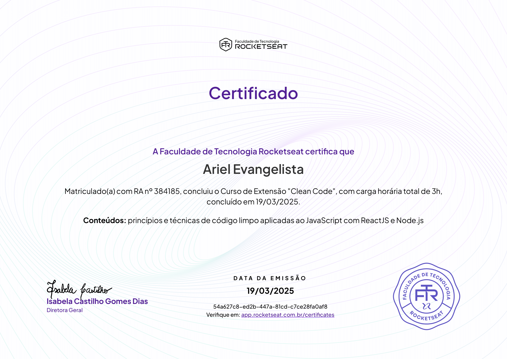

# Clean Code

This repository contains examples and implementations of clean code principles and domain-driven design.

## SOLID Principles

### Single Responsibility Principle (SRP)

A class should have only one responsibility.

Example: Each payment method class (`Billet`, `Credit`, `Debit`, `Pix`) in [solid/index.ts](solid/index.ts) has a single responsibility of calculating the discount amount.

### Open/Closed Principle

Software entities should be open for extension, but closed for modification.

Example: The `PaymentMethod` interface in [solid/index.ts](solid/index.ts) allows adding new payment methods without modifying existing code.

### Liskov Substitution Principle

Objects in a program should be replaceable with instances of their subtypes without altering the correctness of that program.

Example: Any class implementing the `PaymentMethod` interface in [solid/index.ts](solid/index.ts) can be used interchangeably without affecting the `CalculateOrderDiscount` class.

### Interface Segregation Principle

A client should never be forced to implement an interface that it doesn't use or clients shouldn't be forced to depend on methods they do not use.

Example: The `PaymentMethod` interface in [solid/index.ts](solid/index.ts) is simple and only includes the `getDiscountAmount` method, ensuring that implementing classes are not forced to implement unused methods.

### Dependency Inversion Principle

High-level modules should not depend on low-level modules. Both should depend on abstractions.

Example: The `CalculateOrderDiscount` class in [solid/index.ts](solid/index.ts) depends on the `PaymentMethod` abstraction rather than concrete payment method classes.

## Domain-Driven Design

### Repositories

The `OrdersRepository` interface in [domain-driven-design/repositories/orders-repository.ts](domain-driven-design/repositories/orders-repository.ts) defines the contract for order repositories. The `PostgresOrdersRepository` class in [domain-driven-design/repositories/postgres/postgres-orders-repository.ts](domain-driven-design/repositories/postgres/postgres-orders-repository.ts) implements this interface to save orders in a Postgres database.

### Use Cases

The `SubmitOrder` use case in [domain-driven-design/use-cases/submit-order.ts](domain-driven-design/use-cases/submit-order.ts) handles the process of submitting an order.

### Domain Models

- The `Order` class in [domain-driven-design/domain/purchases/order.ts](domain-driven-design/domain/purchases/order.ts) represents an order.
- The `Customer` class in [domain-driven-design/domain/purchases/customer.ts](domain-driven-design/domain/purchases/customer.ts) represents a customer.
- The `Recipient` class in [domain-driven-design/domain/logistics/recipent.ts](domain-driven-design/domain/logistics/recipent.ts) represents a recipient.

## Certification

Certificado de conclusão  
A Rocketseat certifica que  
Ariel Evangelista

princípios e técnicas de código limpo aplicadas ao JavaScript  
com ReactJS e Node.js  
DATA DE EMISSÃO:  
19/03/2025

54a627c8-ed2b-447a-81cd-c7ce28fa0af8  
Acesse em: [https://app.rocketseat.com.br/certificates/54a627c8-ed2b-447a-81cd-c7ce28fa0af8](https://app.rocketseat.com.br/certificates/54a627c8-ed2b-447a-81cd-c7ce28fa0af8)
